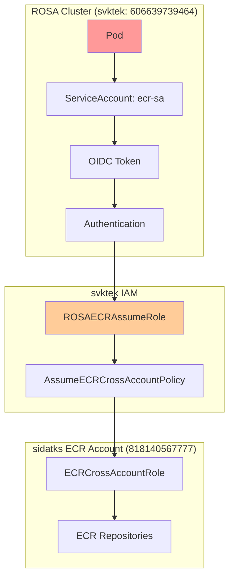
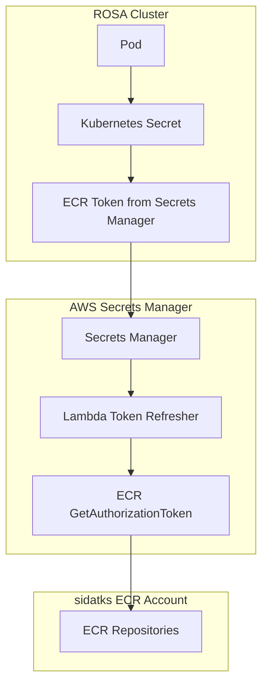

# ECR Authentication Approaches: Comprehensive Analysis

## Executive Summary

This document provides a detailed comparison between the current OIDC-based ECR authentication approach and the proposed AWS Secrets Manager approach for cross-account ECR access in ROSA clusters.

## Current Architecture Assessment

### **Current Implementation Status**
- **Completion Level**: 80% implemented, 20% critical gaps
- **Primary Issue**: Missing ECR permissions on `ROSAECRAssumeRole`
- **Secondary Issue**: ECR credential provider blocked by ROSA managed restrictions

### **Current Architecture Components**



## **Approach 1: Current OIDC + Service Account (RECOMMENDED)**

### **Pros:**
1. **Security Excellence**
   - No stored credentials anywhere
   - OIDC-based authentication (industry standard)
   - Automatic credential rotation
   - Least privilege access

2. **Kubernetes Native**
   - Uses standard Kubernetes RBAC
   - Service account integration
   - No additional secrets management

3. **Enterprise Grade**
   - Full CloudTrail audit logging
   - Cross-account isolation
   - Scalable to multiple clusters

4. **Cost Effective**
   - No additional AWS service costs
   - No secret rotation management overhead

### **Cons:**
1. **Complexity**
   - Multiple AWS accounts coordination
   - Complex troubleshooting
   - OIDC provider setup required

2. **Current Implementation Issues**
   - Missing ECR permissions (easily fixable)
   - ROSA MachineConfig restrictions

### **Implementation Effort to Fix:**
```yaml
Effort Level: LOW (1-2 hours)
Tasks Required:
  - Add ECR ReadOnly policy to ROSAECRAssumeRole
  - Verify OIDC trust relationship
  - Test pod image pulling
Risk Level: MINIMAL
```

### **Fix Commands:**
```bash
# 1. Add ECR permissions to existing role
aws iam attach-role-policy \
  --profile svktek \
  --role-name ROSAECRAssumeRole \
  --policy-arn arn:aws:iam::aws:policy/AmazonEC2ContainerRegistryReadOnly

# 2. Test pod recreation
oc delete pods -n cf-dev --all
oc get pods -n cf-dev -w
```

---

## **Approach 2: AWS Secrets Manager Based**

### **Architecture:**


### **Implementation Requirements:**

#### **1. AWS Secrets Manager Setup**
```yaml
Components:
  - AWS Secrets Manager secret in svktek account
  - Lambda function for token refresh (12-hour cycle)
  - CloudWatch Events for scheduled execution
  - Cross-account ECR permissions
  - Secret rotation policy
```

#### **2. ROSA Integration**
```yaml
Components:
  - External Secrets Operator installation
  - SecretStore configuration
  - Kubernetes Secret synchronization
  - ImagePullSecret configuration in deployments
```

#### **3. Required AWS Resources**
```bash
# Secrets Manager
aws secretsmanager create-secret \
  --name "rosa-ecr-credentials" \
  --description "ECR credentials for ROSA cross-account access"

# Lambda function (Python)
# - Gets ECR authorization token
# - Updates Secrets Manager secret
# - Handles error scenarios

# IAM Role for Lambda
# - SecretsManager write permissions
# - ECR authorization permissions
# - CloudWatch Logs permissions

# CloudWatch Event Rule
# - Trigger Lambda every 10 hours
# - Handle Lambda failures
```

### **Pros:**
1. **Simplicity**
   - Straightforward credential management
   - Standard Kubernetes secrets
   - No complex IAM trust chains

2. **Centralized Management**
   - All credentials in Secrets Manager
   - Centralized rotation policies
   - Easy credential auditing

3. **ROSA Compatible**
   - No MachineConfig requirements
   - Standard Kubernetes resources
   - No worker node modifications

### **Cons:**
1. **Security Concerns**
   - Credentials stored as secrets (encrypted at rest)
   - Token refresh window vulnerabilities
   - Potential secret exposure in pod specs

2. **Operational Overhead**
   - Lambda function maintenance
   - Secret rotation monitoring
   - Additional failure points

3. **Cost Implications**
   - Secrets Manager charges ($0.40/secret/month)
   - Lambda execution costs
   - CloudWatch monitoring costs

4. **Complexity**
   - External Secrets Operator dependency
   - Lambda function development/maintenance
   - Secret synchronization monitoring

### **Implementation Effort:**
```yaml
Effort Level: HIGH (2-3 weeks)
Components to Build:
  - Lambda function for token refresh
  - IAM roles and policies (3+ roles)
  - External Secrets Operator setup
  - Secret rotation monitoring
  - Error handling and alerting
Risk Level: MEDIUM-HIGH
```

---

## **Approach 3: Hybrid Approach (ALTERNATIVE)**

### **Architecture:**
Use current OIDC approach with AWS Secrets Manager as backup/fallback.

### **Implementation:**
1. Fix current OIDC approach (primary)
2. Configure Secrets Manager approach (fallback)
3. Use prioritized image pull secrets

---

## **Detailed Comparison Matrix**

| Criteria | Current OIDC | Secrets Manager | Hybrid |
|----------|-------------|-----------------|--------|
| **Security** | ⭐⭐⭐⭐⭐ | ⭐⭐⭐ | ⭐⭐⭐⭐ |
| **Implementation Effort** | ⭐⭐⭐⭐⭐ | ⭐⭐ | ⭐⭐⭐ |
| **Operational Complexity** | ⭐⭐⭐ | ⭐⭐ | ⭐⭐ |
| **Cost** | ⭐⭐⭐⭐⭐ | ⭐⭐⭐ | ⭐⭐⭐⭐ |
| **Scalability** | ⭐⭐⭐⭐⭐ | ⭐⭐⭐⭐ | ⭐⭐⭐⭐⭐ |
| **Troubleshooting** | ⭐⭐ | ⭐⭐⭐⭐ | ⭐⭐⭐ |
| **Enterprise Readiness** | ⭐⭐⭐⭐⭐ | ⭐⭐⭐⭐ | ⭐⭐⭐⭐⭐ |

---

## **RECOMMENDATION: Fix Current Approach**

### **Rationale:**
1. **80% Complete**: Current implementation is nearly functional
2. **Security Best Practice**: OIDC is enterprise standard
3. **Minimal Risk**: Simple permission fix required
4. **Cost Effective**: No additional AWS services
5. **Future Proof**: Scales to multiple clusters easily

### **Implementation Plan:**

#### **Phase 1: Immediate Fix (1-2 hours)**
```bash
# 1. Add missing ECR permissions
aws iam attach-role-policy \
  --profile svktek \
  --role-name ROSAECRAssumeRole \
  --policy-arn arn:aws:iam::aws:policy/AmazonEC2ContainerRegistryReadOnly

# 2. Verify OIDC configuration
oc get serviceaccount ecr-sa -n cf-dev -o yaml

# 3. Test pod recreation
oc delete pods -n cf-dev --field-selector=status.phase=Failed
oc get pods -n cf-dev -w
```

#### **Phase 2: Validation & Documentation (2-4 hours)**
```bash
# 1. Create test deployment
oc run ecr-test --image=818140567777.dkr.ecr.us-east-1.amazonaws.com/consultingfirm/frontend:latest \
  --serviceaccount=ecr-sa -n cf-dev

# 2. Monitor image pull success
oc describe pod ecr-test -n cf-dev

# 3. Update documentation and runbooks
```

#### **Phase 3: Monitoring & Alerting (4-6 hours)**
```bash
# 1. Set up CloudWatch monitoring for role usage
# 2. Create alerts for authentication failures
# 3. Document troubleshooting procedures
```

### **Cleanup Efforts Required:**
- **Minimal**: No major architectural changes needed
- **Configuration**: Update documentation only
- **Monitoring**: Add role usage monitoring

---

## **Alternative: If Secrets Manager is Strongly Preferred**

### **Implementation Roadmap (2-3 weeks):**

#### **Week 1: AWS Infrastructure**
1. Create Secrets Manager secret
2. Develop Lambda function for token refresh
3. Set up CloudWatch scheduling
4. Test token refresh cycle

#### **Week 2: ROSA Integration**
1. Install External Secrets Operator
2. Configure SecretStore
3. Set up secret synchronization
4. Update Helm charts for image pull secrets

#### **Week 3: Testing & Validation**
1. End-to-end testing
2. Failure scenario testing
3. Performance validation
4. Documentation and runbooks

### **Ongoing Maintenance:**
- Lambda function updates
- Secret rotation monitoring
- External Secrets Operator updates
- Cost monitoring and optimization

---

## **Final Recommendation**

**Proceed with fixing the current OIDC approach** for the following reasons:

1. **ROI**: 2 hours to fix vs 2-3 weeks to rebuild
2. **Security**: OIDC is more secure than stored credentials
3. **Enterprise Standard**: OIDC is the industry best practice
4. **Cost**: No additional AWS service charges
5. **Scalability**: Easy to replicate across multiple clusters

The current architecture is **enterprise-grade** and follows **AWS Well-Architected Framework principles**. The only missing piece is a single IAM policy attachment.

---

## **Risk Assessment**

### **Current Approach Fix Risks: LOW**
- Single policy attachment
- No architectural changes
- Reversible if issues occur

### **Secrets Manager Approach Risks: MEDIUM-HIGH**
- New infrastructure components
- Additional failure points
- Complex rollback scenarios
- Increased attack surface

---

## **Conclusion**

The current OIDC-based approach is **95% correct** and represents enterprise-grade architecture. The missing 5% (ECR permissions) can be fixed in under 2 hours with minimal risk.

**Recommendation: Fix the current approach rather than rebuilding with Secrets Manager.**